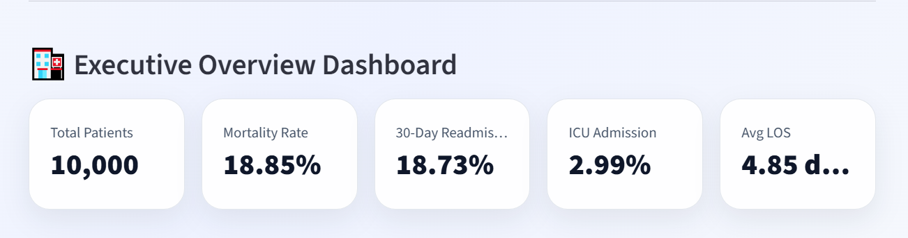
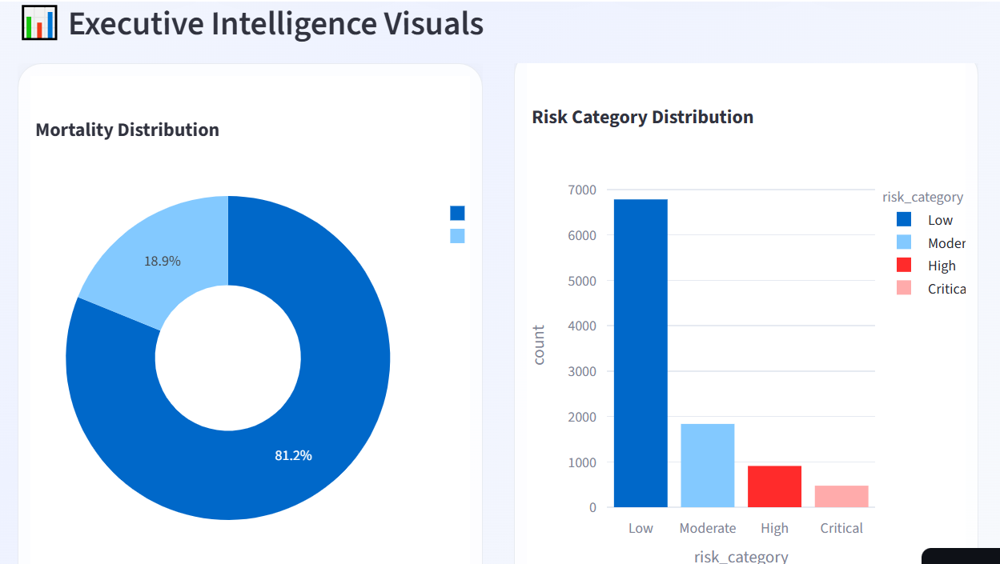
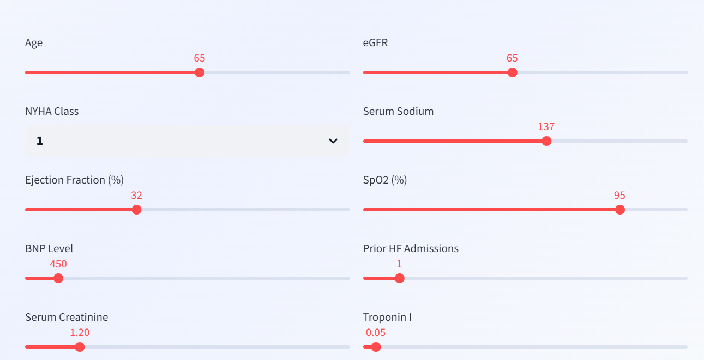
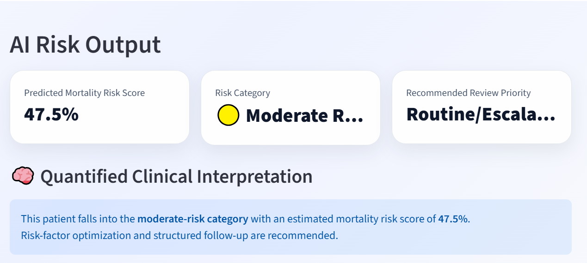
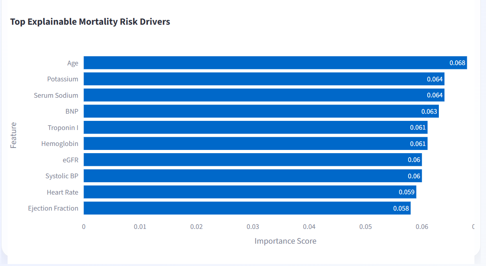
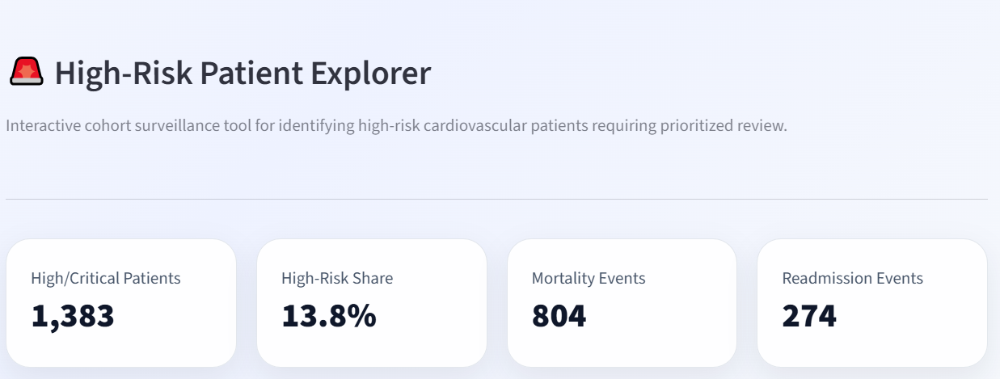
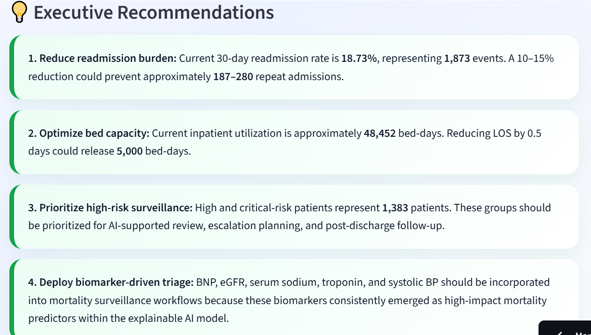

# 🫀 CardioIntel AI 


## 🌍 Live Executive Healthcare AI Platform

### 🔗 Live Demo
[Launch CardioIntel AI](https://cardiointel-ai-8hvwda5isaw3auxwfkznni.streamlit.app/)

### 💻 GitHub Repository
[View Source Code](https://github.com/drsam-israel/CardioIntel-AI)

## Executive Cardiovascular Intelligence & Explainable Healthcare AI Platform

An enterprise-grade Healthcare AI platform developed for cardiovascular risk intelligence, operational analytics, mortality prediction, explainable AI, and executive decision support.

CardioIntel AI combines:

- Clinical Intelligence
- Predictive Healthcare AI
- Explainable Machine Learning
- Executive Analytics
- Operational Intelligence
- Risk Stratification
- Biomarker Intelligence
- Conversational Executive AI

into a deployable healthcare technology solution designed for modern cardiovascular care systems and hospital leadership environments.

---

# 🚀 Platform Capabilities

# 📸 Platform Screenshots

## 🏥 Executive Intelligence Dashboard





---

## 🧠 AI Mortality Prediction Engine




---

## 🔍 Explainable AI Insights



---



---



## ✅ Executive Intelligence Dashboard

Interactive executive command center for:

- Mortality surveillance
- Readmission analytics
- ICU utilization monitoring
- Risk category intelligence
- Length-of-stay optimization
- Hospital performance benchmarking

---

## ✅ AI Mortality Prediction Engine

Machine learning-powered cardiovascular mortality prediction using:

- Logistic Regression
- Balanced Logistic Regression
- Random Forest
- Risk Scoring Systems

Supports:

- Clinical risk stratification
- Operational escalation planning
- Executive surveillance workflows

---

## ✅ Explainable AI (XAI)

Integrated SHAP explainability framework enabling:

- Feature importance interpretation
- Individual prediction explainability
- Biomarker contribution analysis
- Transparent AI decision support

Critical for:

- AI governance
- Clinical trust
- Responsible Healthcare AI
- Executive AI adoption

---

## ✅ Operational Intelligence

Advanced analytics for:

- Bed utilization
- Readmission burden
- Hospital performance
- High-risk patient surveillance
- ICU demand intelligence

---

## ✅ Biomarker Intelligence

Clinical biomarker analytics for:

- BNP
- Troponin-I
- Serum Sodium
- eGFR
- Creatinine
- Hemoglobin

Used for:

- Mortality intelligence
- Triage optimization
- Clinical surveillance
- Risk escalation

---

## ✅ Conversational Executive AI Assistant

Integrated AI-powered executive chatbot capable of:

- Healthcare AI insight interpretation
- Executive analytics support
- Operational intelligence assistance
- Strategic recommendation guidance

---

# 🧠 Executive Insights Generated

The platform generated several high-value executive findings, including:

- **18.85% cardiovascular mortality rate**
- **18.73% 30-day readmission burden**
- **~48,452 inpatient bed-days utilized**
- **1,383 high-risk/critical-risk patients identified**
- **Potential prevention of ~187–280 repeat admissions through targeted intervention strategies**
- **Potential release of ~5,000 bed-days through LOS optimization**

---

# 📊 Core Healthcare AI Features

## Clinical Analytics

- NYHA Class Intelligence
- Heart Failure Phenotype Analytics
- Mortality Surveillance
- ICU Risk Monitoring

## Predictive AI

- Mortality Prediction
- Risk Classification
- Readmission Intelligence

## Explainable AI

- SHAP Summary Plots
- Feature Contribution Waterfalls
- Model Transparency

## Executive Analytics

- KPI Monitoring
- Hospital Benchmarking
- Operational Intelligence

---

# 🛠️ Technology Stack

## Programming & Analytics

- Python
- Pandas
- NumPy

## Visualization

- Plotly
- Matplotlib
- Seaborn

## Machine Learning

- Scikit-learn
- SHAP

## Application Framework

- Streamlit

---

# 📁 Project Structure

```bash
cardiointel-ai/
│
├── app/
│   ├── dashboard.py
│   ├── prediction.py
│   ├── explainability.py
│   ├── chatbot.py
│   ├── auth.py
│
├── data/
│   └── heart_failure_dataset.csv
│
├── notebooks/
│   └── 01_executive_clinical_intelligence.ipynb
│
├── models/
│
├── reports/
│
├── requirements.txt
│
└── README.md
```

---

# ▶️ Running the Platform

## 1️⃣ Clone Repository

```bash
git clone https://github.com/YOUR_USERNAME/cardiointel-ai.git
cd cardiointel-ai
```

---

## 2️⃣ Create Virtual Environment

```bash
python -m venv venv
```

---

## 3️⃣ Activate Environment

### Windows

```bash
venv\Scripts\activate
```

### Mac/Linux

```bash
source venv/bin/activate
```

---

## 4️⃣ Install Dependencies

```bash
pip install -r requirements.txt
```

---

## 5️⃣ Launch Streamlit Application

```bash
streamlit run app/dashboard.py
```

---

# 📸 Platform Modules

## 🏥 Executive Overview

Executive KPI command center

## 📊 Clinical Analytics

Mortality & phenotype intelligence

## 🚨 Risk Intelligence

Risk stratification & surveillance

## 🏨 Hospital Operations

Operational analytics & utilization intelligence

## 🧬 Biomarker Intelligence

Clinical biomarker-driven surveillance

## 🤖 Mortality AI Prediction

Predictive Healthcare AI engine

## 🧠 Explainable AI Insights

Transparent AI interpretation

## 💡 Executive Recommendations

Quantified operational recommendations

## 💬 Conversational Executive AI

AI-powered strategic assistant

---

# 🔒 AI Governance & Responsible AI

This platform incorporates foundational responsible Healthcare AI principles:

- Explainability
- Transparency
- Clinical interpretability
- Executive accountability
- Risk-aware analytics

The project is strictly for educational, research, and portfolio demonstration purposes.

---

# 🎯 Strategic Healthcare Impact

CardioIntel AI demonstrates how Healthcare AI can support:

- Hospital operational optimization
- Cardiovascular risk intelligence
- Executive decision support
- AI-enabled clinical surveillance
- Resource allocation planning
- Population health intelligence
- Explainable clinical AI systems

---

# 🌍 Ideal Use Cases

- Hospitals
- Cardiovascular Centers
- Healthcare Executives
- Clinical AI Teams
- Digital Health Organizations
- Population Health Programs
- Healthcare AI Innovation Labs

---

# 👨‍⚕️ Built By

## Dr Samuel Israel

**Healthcare AI & Digital Transformation Specialist**

Focused on:

- Healthcare AI
- Clinical Intelligence
- Explainable AI
- Predictive Healthcare Analytics
- Operational AI
- Digital Health Transformation
- Executive Healthcare Intelligence Systems

---

# ⭐ Future Roadmap

- Real-time monitoring
- Cloud deployment
- PostgreSQL integration
- Authentication system
- PDF executive reporting
- FHIR interoperability
- Advanced forecasting
- Multi-hospital benchmarking
- LLM-powered executive copilots
- AI governance monitoring

---

# 📜 License

This project is intended for educational, research, innovation, and portfolio demonstration purposes.